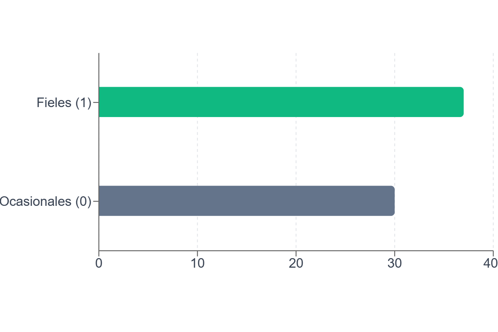
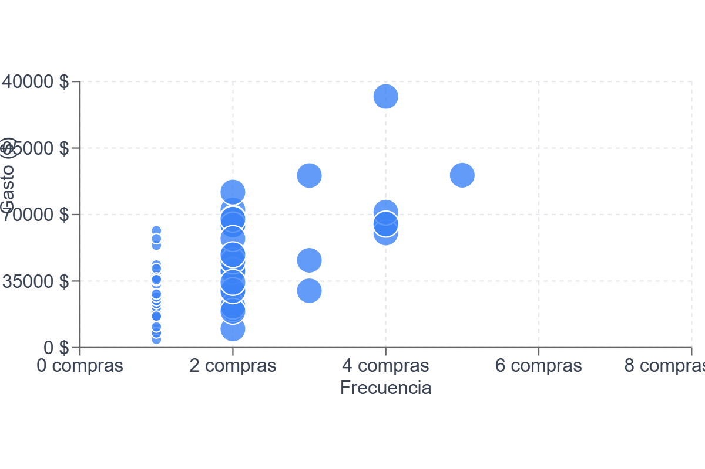
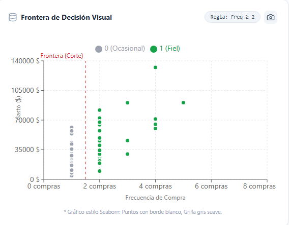

# Proyecto Aurelion - Sprint 3: Clasificación de Fidelidad (Machine Learning)

## 📝 Inventario de Entrega
Este proyecto se compone de los siguientes archivos técnicos para su ejecución y evaluación en Visual Studio Code:

1.  **sprint3_aurelion_notebook.ipynb** (Notebook Principal con Gráficos y Guardado del Modelo)
2.  **master_rfm_aurelion_limpio.csv** (Dataset Procesado - Requisito obligatorio)
3.  **entrenamiento_modelo_aurelion.py** (Script de Entrenamiento Depurado)
4.  **grafico_distribucion_target.png** (Imagen para soporte)
5.  **grafico_frecuencia_vs_gasto.png** (Imagen para soporte)
6.  **grafico_frontera_decision.png** (Imagen para soporte)

---

## 1. Objetivo del Modelo
**Problema:** La tienda Aurelion posee transacciones históricas pero carece de una segmentación predictiva.
**Solución:** Implementación de un modelo de Machine Learning (Clasificación Binaria) que etiqueta a los clientes como **Fieles** o **Ocasionales**.

---

## 2. Descripción del Dataset (X e y)

Estructura de variables para el entrenamiento del modelo:

| Rol en ML | Variable | Definición Técnica |
|-----------|----------|-----------------------------|
| **y (Target)** | `is_fidelizado` | **Variable Objetivo.**   1 = Cliente Fiel (Frecuencia ≥ 2).   0 = Cliente Ocasional (Frecuencia = 1). |
| **X (Excluido)** | `frequency` | **Variable de Regla de Negocio.** Se excluye del set de entrenamiento para evitar Data Leakage. |
| **X (Feature)** | `recency_days` | **Predictor.** Días transcurridos desde la última transacción. |
| **X (Feature)** | `monetary_log` | **Predictor.** Logaritmo natural del monto total gastado. |

### 🚨 Decisión Técnica: Prevención de Data Leakage
**¿Por qué eliminamos 'frequency' del entrenamiento?**
Definimos que *Fiel* es quien compró 2 o más veces. Si le damos la frecuencia al modelo, aprende la regla de memoria (Frecuencia >= 2 -> Fiel) y obtiene 100% de precisión falsa.
Al eliminarla, obligamos al modelo a predecir basándose solo en **Recencia** y **Monto**, lo cual nos permite evaluar potenciales clientes fieles desde su primera compra.

---

## 3. Justificación Metodológica

### ¿Por qué Clasificación y no Clustering (K-Means)?
Se optó por un modelo Supervisado (Clasificación) en lugar de No Supervisado (K-Means) porque:
1.  **Objetivo Definido:** El negocio ya tiene una definición clara de éxito ("Fiel" vs "Ocasional"). K-Means es exploratorio y se usa cuando no conoces los grupos.
2.  **Predicción Directa:** Necesitamos predecir la probabilidad de fidelidad de nuevos clientes para accionar. La clasificación nos da esa respuesta directa.

### ¿Por qué Regresión Logística y no Lineal?
1.  **Salida Binaria:** La Regresión Lineal predice valores infinitos. La Logística está diseñada matemáticamente para resultados binarios (0 o 1).
2.  **Probabilidad:** La Logística entrega un porcentaje de probabilidad, ideal para hacer scoring de clientes.

---

## 4. Especificaciones Técnicas

*   **Algoritmo:** Regresión Logística (`LogisticRegression`)
*   **Librería:** Scikit-Learn
*   **Optimizador:** `liblinear`
*   **Hiperparámetros:** Tasa de Aprendizaje = 0.01, Iteraciones = 100.

---

## 5. Estructura del Proyecto (Guía para la Demo)

| Componente | Ubicación en VS Code |
|-----------------|----------------------------|
| 1. Objetivo | Sección 1 de este documento. |
| 2. Dataset (X e y) | Sección 2 de este documento. |
| 3. Preprocesamiento | Notebook (Celda 3): `StandardScaler` y `OneHotEncoder`. |
| 4. División Train/Test | Notebook (Celda 4): `train_test_split`. |
| 5. Selección Algoritmo | Notebook: Instancia de `LogisticRegression`. |
| 6. Entrenamiento | Notebook: Ejecución de `.fit(X_train, y_train)`. |
| 7. Predicciones | Notebook: Ejecución de `.predict(X_test)`. |
| 8. Métricas | Notebook: `confusion_matrix`, Reporte de Clasificación. |
| 9. Modelo Final | Script exportable `entrenamiento_modelo_aurelion.py`. |
| 10. Gráficos | Generados en el Notebook o adjuntos en la carpeta. |

---

## 6. Visualización

### Distribución del Target

### Patrón de Comportamiento

### Frontera de Decisión

---

## 🚀 Oportunidad de Mejora: Fase 2 (Inferencia y Scoring)

**Más allá del Sprint:**
Aunque el requerimiento del Sprint finaliza con el entrenamiento del modelo, hemos decidido avanzar hacia una **implementación realista** para demostrar el valor de negocio.

**¿Por qué esta evolución?**
Un modelo guardado no genera valor si no se utiliza. Hemos creado un script de **Inferencia** (ubicado en la carpeta `BONUS_Fase_2_Prediccion`) que simula la llegada de nuevos datos y utiliza el modelo `.pkl` para tomar decisiones automáticas.

### 🧪 Sobre los Datos de Prueba (Simulación)
Para ejecutar esta fase de inferencia **no hace falta cargar un CSV externo**.

*   **Mecanismo:** El script `prediccion_nuevos_clientes.py` contiene un generador interno de datos sintéticos (un diccionario de Python) que crea 5 perfiles de clientes ficticios al ejecutarse.
*   **Objetivo:** Esto demuestra cómo el modelo podría integrarse en un sistema en tiempo real (como una API o una Web) donde los datos llegan "en vivo", sin depender siempre de archivos estáticos.

**Archivos en la carpeta BONUS:**
1.  `prediccion_nuevos_clientes.py`: Script que carga el cerebro del modelo, genera datos simulados de nuevos clientes y aplica las predicciones.
2.  `REPORTE_FINAL_MARKETING.csv`: El resultado tangible para el negocio. Una lista de clientes con su probabilidad de fidelidad calculada y la etiqueta **"⭐ FIDELIZAR"** asignada automáticamente.

**Conclusión:**
Esto cierra el ciclo completo de Data Science: **Entrenamiento (Pasado) -> Inferencia (Futuro).**